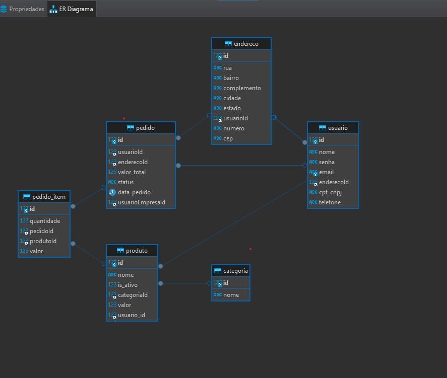
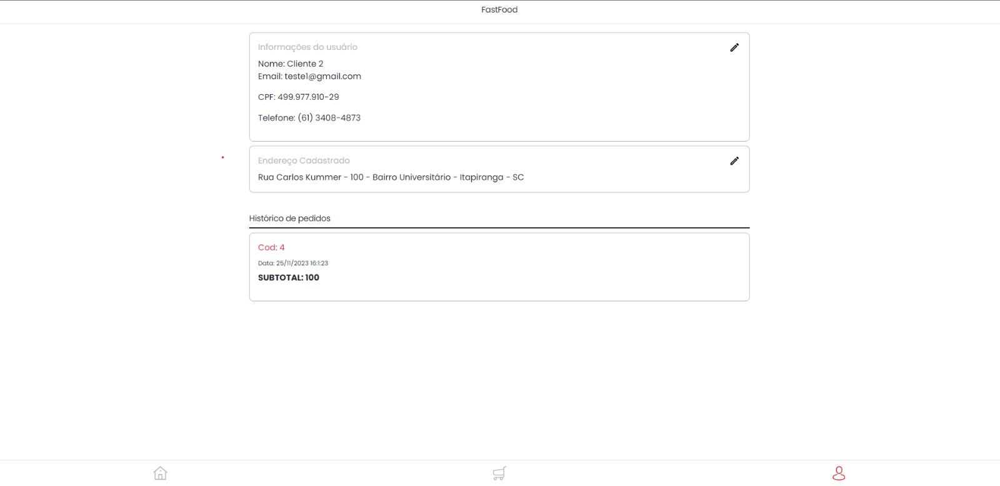
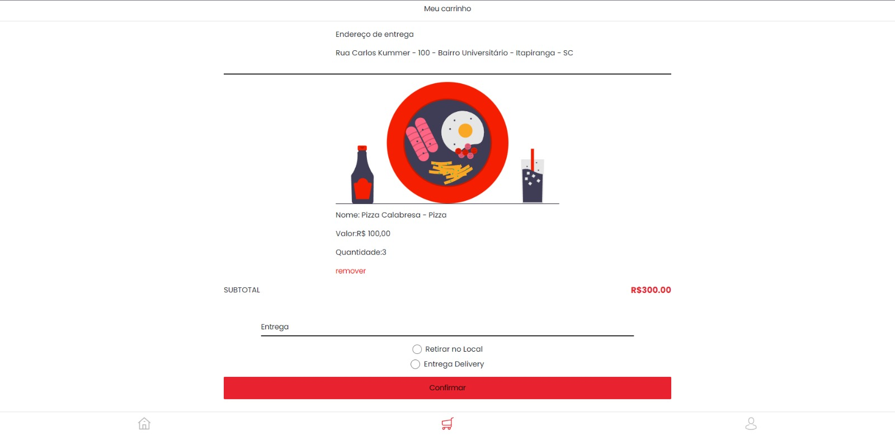
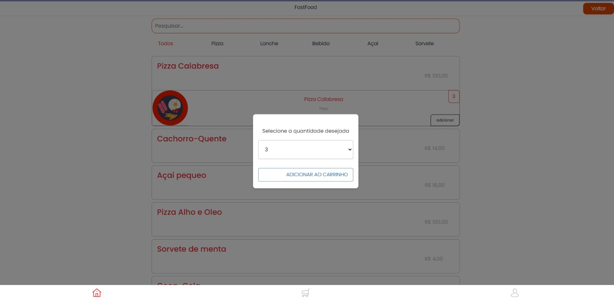
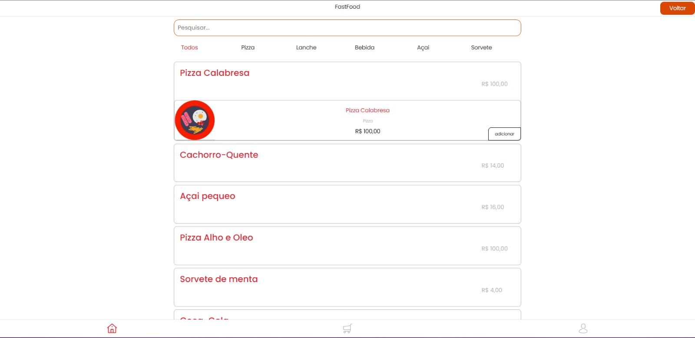
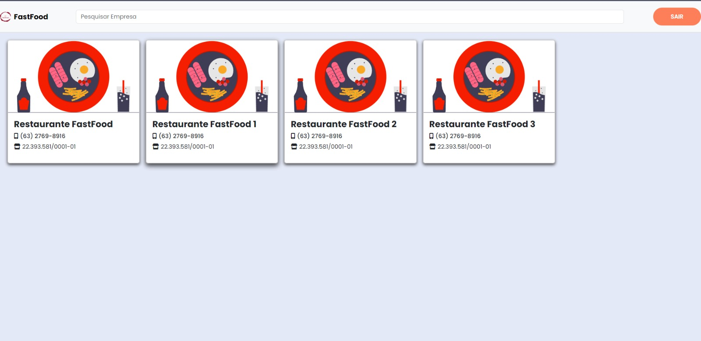
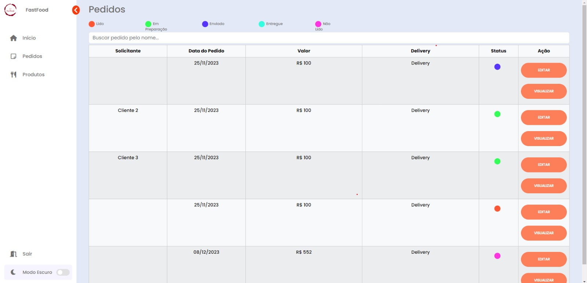
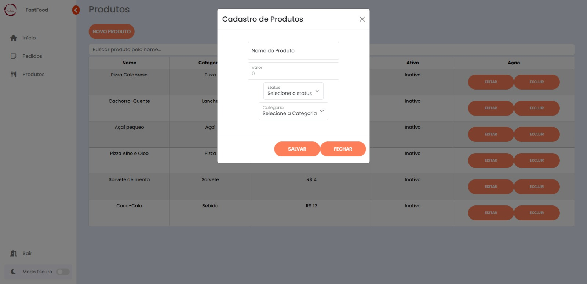

# FastFood
O projeto a seguir foi desenvolvido com fins acadêmicos, o mesmo utiliza Nest.js e React, com MySQL como banco de dados. Esse projeto tem como intuito criar uma plataforma a qual atue da mesma maneira que o iFood, essa plataforma tem duas interfaces gráficas sendo elas totalmente responsivas para dispositivos mobiles. 
Ao iniciar o cadastro de um novo usuário, a empresa Restaurante e o Cliente são diferenciados pela forma de preeenchimento do campo CPF/CNPJ, o qual CNPJ ficaria apenas para empresas restaurantes. No final desse arquivo é possível encontrar alguams capturas de telas as quais apresentam melhor a interface gráfica da aplicação.
Um ponto que considerei ao desenvolver um sistema web totalmente responsivo é que ele dispoensa a necessidade da criação de um aplicativo, dessa forma é possivel acessar a aplicação de multiplos ambientes.

## Objetivos do Sistema

Este projeto tem como objetivo criar um sistema de fast-food eficiente, proporcionando uma experiência fácil e rápida para os usuários ao realizar pedidos online.

## Tecnologias Utilizadas

- Nest.js
- React
- MySQL

## Como Foi Construído

O sistema foi construído seguindo os princípios da programação orientada a objetos. Foram criadas classes genéricas, das quais as classes específicas estendem, facilitando a manutenção e expansão do código.

## Como Executar

Para executar o projeto localmente, siga as instruções abaixo:

```bash
git clone https://github.com/eimmig/projeto-fast-food1.git

-front

cd projeto-fast-food1/client/fast-food-client
npm install
npm num dev

-back

cd projeto-fast-food1/server/fast-food-server
npm install
npm start
```

## Capturas do Projeto:









